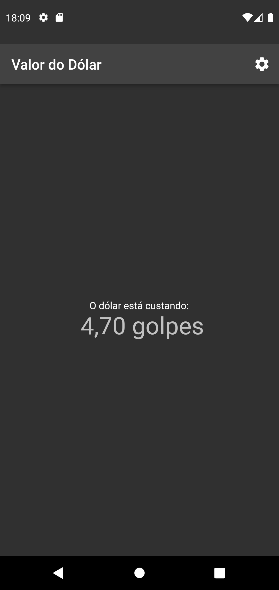
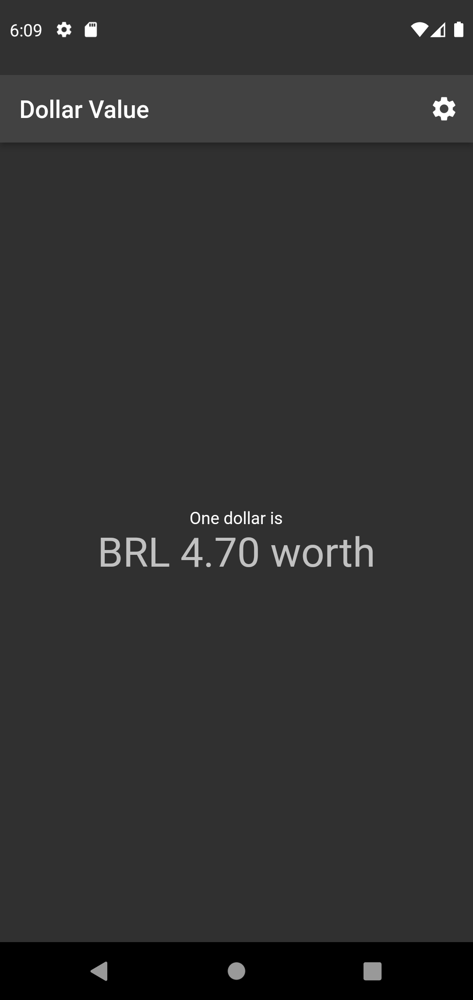
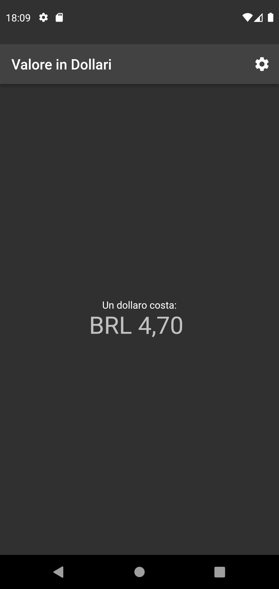

# Valor do Dólar

Aplicativo feito em Flutter para estudos.

O objetivo é consumir uma API para mostrar o valor atualizado do dólar.

    
    
    

## TODO

✅ Consumir API

✅ Localização em português, inglês e italiano

✅ Ícone e nome localização no laucher (Android)

⬜ Ícone e nome localização no laucher (iOS)

⬜ Usar Redis para armazenar valor do dólar por 24h e economizar o consumo da API
